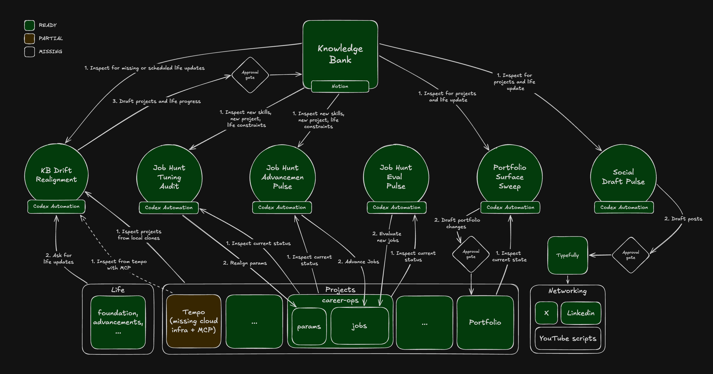

<p align="center">
  
</p>

<h1 align="center">Knowledge System</h1>

<p align="center">
  <strong>Infrastructure-as-Code for a personal agent operating system.</strong><br>
  <sub>Your knowledge stays where you work. Only the agent protocol lives in Git.</sub>
</p>

<p align="center">
  <a href="https://github.com/giacomoguidotto/knowledge-system/actions"></a>
  <a href="https://github.com/giacomoguidotto/knowledge-system/releases"></a>
  <a href="https://github.com/giacomoguidotto/knowledge-system/blob/main/LICENSE"></a>
</p>

<br>

AI agents are only as useful as the context they can reach, and every local copy of that context goes stale. **Knowledge System** keeps the boundary sharp: your knowledge stays in the provider you already use, and this repo holds only the protocol your agents follow to read it, write to it behind approval, and reconcile durable signals. Nothing here mirrors your Knowledge Bank.

<p align="center">
  
</p>

<p align="center">
  <sub>The provider is the memory · the runtime runs the automations · this repo is the spec.</sub>
</p>

## Install

1. Fork and clone this repo.
2. Open your favorite agent in the repo and run:

```sh
/setup-knowledge-system reconcile
```

This connects your Knowledge Bank provider, preserves your personal **bindings** in a gitignored file, installs the shared interface package, and materializes KB Reconcile. Your knowledge never enters the repo.

## What's Inside

**Skills** — install into any agent that follows the `SKILL.md` standard:

- **`/lookup`** — read-only retrieval from your Knowledge Bank.
- **`/capture`** — writes, always behind an approval draft (below).
- **`/setup-knowledge-system check|reconcile`** — checks or reconciles the standalone System.

**Interfaces**: provider-blind data packages installed once per harness:

- **`knowledge-system-interface/v1`**: role-based requests, typed snapshots,
  provenance, drift protection, and semantic capture drafts.

**Automation**: the self-contained setup module owns the canonical [KB Reconcile definition](skills/public/setup-knowledge-system/resources/automations/kb-reconcile/definition.md). Setup materializes it in place while preserving harness identity and runtime history.

Every write goes through a reviewable draft first — the exact property and body diffs, plus the evidence read — and waits for your explicit approval:


<sub>Mock data. Nothing is written until you approve the exact draft.</sub>

## Contributing

Free and open source under the [MIT License](LICENSE). Agents should start at [AGENTS.md](AGENTS.md); see [CONTRIBUTING.md](.github/CONTRIBUTING.md) to get involved.
