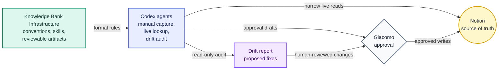

  <!-- Logo slot: add assets/logo.png, assets/logo.svg, or light/dark logo variants here. -->

<h1 align="center">Knowledge Bank Infrastructure</h1>

  <strong>Agent infrastructure for a Notion-first knowledge bank.</strong> 
  Repo-owned conventions, skills, and reviewable artifacts for Giacomo's Notion workspace.

  
  

 

Knowledge Bank Infrastructure keeps agents pointed at the right source of truth. Notion owns the actual personal knowledge, tasks, projects, and portfolio facts; this repo holds the conventions and skills that make that workspace usable by Codex and other agents.

Generated files under `dist/` are reviewable outputs, not canonical records.

Use the full name, Knowledge Bank Infrastructure, in human-facing prose. Use the slug `kb-infra` for repository paths, URLs, generated artifact identifiers, and other machine-facing handles.

## Workflow Map

Knowledge Bank Infrastructure sits beside the canonical Notion workspace. It does not mirror or replicate Notion; it tells agents how to read, draft, and audit it.

## What's Inside

- `AGENTS.md`: entry point for agents working in this repo.
- `CONTEXT.md`: vocabulary for the current operating model.
- `docs/workflows.md`: accepted live workflows.
- `docs/knowledge-bank-conventions.md`: formal conventions for the Notion `life` database and drift audits.
- `docs/agents/`: navigation and issue-tracker guidance for agents.
- `skills/`: repo-owned agent workflows.
- `dist/`: generated review artifacts.

## Principles

- Notion is canonical.
- This repo documents conventions; it does not duplicate the Knowledge Bank.
- Agents should use narrow live Notion lookup when task context requires it.
- Notion writes require explicit approval of the exact draft.
- Drift audits are read-only and propose fixes for human approval.
- Codex memory should keep routing facts and preferences, not Notion content.

## Contributing

Free and open source under the [MIT License](LICENSE). See [CONTRIBUTING.md](.github/CONTRIBUTING.md) to get involved.

Agents should start at [AGENTS.md](AGENTS.md).
