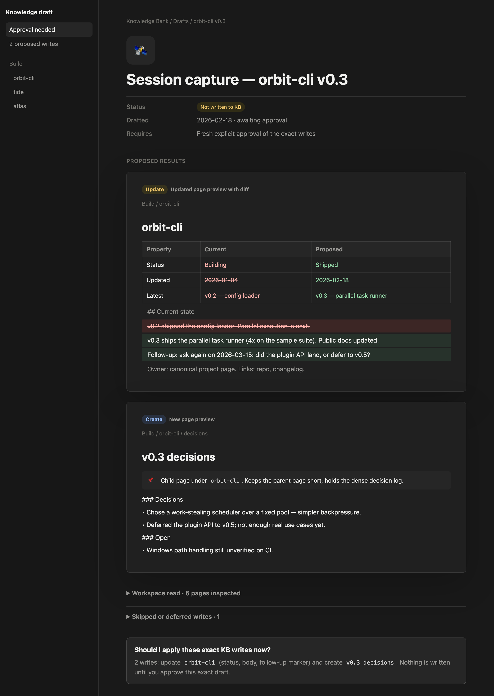

<p align="center">
  
</p>

<h1 align="center">Knowledge Bank Infrastructure</h1>

<p align="center">
  <strong>Infrastructure-as-Code for a personal agent operating system.</strong><br>
  <sub>The provider is the memory. The runtime runs the automations. This repo is the spec.</sub>
</p>

<p align="center">
  <a href="https://github.com/giacomoguidotto/kb-infra/actions"></a>
  <a href="https://github.com/giacomoguidotto/kb-infra/blob/main/LICENSE"></a>
</p>

<br>

AI agents are useful only when they can find the right context without turning that context into another stale copy. Knowledge Bank Infrastructure keeps that boundary sharp: your knowledge stays where you work, and only the agent protocol lives in Git.

## Core Idea

**Keep the knowledge where the human works. Put the agent protocol in Git.**

Nothing in this repo runs. It is the declarative source for an agent operating system whose parts live elsewhere — the same way Terraform files declare a cloud without being one:

- The **Knowledge Bank** (a provider like Notion) is the memory.
- The **harness runtime** (a scheduler like Codex) runs the automations.
- **This repo** is the spec: the agent tool belt, the scheduled rituals, and the shape of the memory — authored, versioned, and reviewed here before they *materialize* into live systems.

Personal values never get committed. Which provider, which repos, which cadence — all of it is a **binding**, collected at setup into a gitignored file. The spec stays generic and forkable; your knowledge stays yours.

## What an Approval Looks Like

Every write to the Knowledge Bank goes through a reviewable draft first. The `capture` skill renders the exact proposed writes as a provider-style preview — property diffs, body diffs, and the evidence it read — and waits for explicit approval before touching anything.



<sub>Mock data. Nothing is written until you approve the exact draft.</sub>

## The Tool Belt

Three skills install into any agent that follows the `SKILL.md` standard:

- **`/lookup`** — read-only retrieval from the Knowledge Bank. Resolves context live; never writes.
- **`/capture`** — approval-gated writes, always behind the draft above.
- **`/setup`** — materializes the infra: connects the provider, collects bindings, installs the skills, and bootstraps the automations.

## The Automations

Scheduled rituals, all rooted in `/lookup` over the Knowledge Bank. Each is a generic prompt in [`docs/automations/`](docs/automations/); the concrete cadence and targets are bindings.

- **Knowledge Bank Drift Realignment** — finds stale, missing, due, or ambiguous knowledge; asks one question at a time; hands the result to `/capture`.
- **Social Draft Pulse** — turns public-safe KB context into approval-gated social drafts.
- **Portfolio Surface Sweep** — compares public-safe KB context with a portfolio repo and proposes approved branch/PR work.
- **Job Hunt Evaluate / Advance / Tune Audit** — drive an external career system through discovery, advancement packs, and strategy tuning.

The external systems an automation drives are **sinks**, referenced by role. In my own setup those sinks are [career-ops](https://github.com/giacomoguidotto/career-ops) and [guidotto.dev](https://github.com/giacomoguidotto/guidotto.dev); yours would be your own.

## Getting Started

```sh
# 1. Fork and clone.
# 2. Open your favorite agent in the repo and run:
/setup
```

`/setup` connects your Knowledge Bank provider, grills you for the bindings it needs (into gitignored `local/bindings.yml`), installs `/lookup` and `/capture`, and stands up the automations. Your knowledge never enters this repo — only the generic spec does. Agents should start at [AGENTS.md](AGENTS.md).

## Repository Map

- `AGENTS.md`: instructions for agents working in this repo (and the setup entry point).
- `CONTEXT.md`: the vocabulary for the operating model.
- `docs/adr/`: the decisions behind the design.
- `docs/workflows.md`: accepted workflows and their boundaries.
- `docs/knowledge-bank-conventions.md`: the reference shape a Knowledge Bank can take.
- `docs/automations/`: the shared preamble and each scheduled automation prompt.
- `skills/`: the `lookup`, `capture`, and `setup` skills.
- `local/`: gitignored bindings; never canonical knowledge.

## Guarantees

- The Knowledge Bank stays canonical; this repo never mirrors it.
- Agents read the KB live instead of from local replicas.
- KB writes require approval of the exact draft.
- Lookup and drift discovery are read-only.
- No personal value is committed; specifics are bindings in gitignored `local/`.

## Contributing

Free and open source under the [MIT License](LICENSE). See [CONTRIBUTING.md](.github/CONTRIBUTING.md) to get involved.
