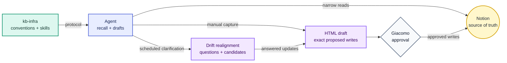

  <!-- Logo slot: add assets/logo.png, assets/logo.svg, or light/dark logo variants here. -->

<h1 align="center">Knowledge Bank Infrastructure</h1>

  <strong>Operational rails for a Notion-first personal knowledge system.</strong> 
  Conventions, agent skills, and reviewable drafts for keeping human-owned knowledge usable by AI agents.

  
  

 

AI agents are useful only when they can find the right context without turning the context itself into another stale copy. Knowledge Bank Infrastructure is the repo that keeps that boundary sharp.

Notion owns the actual knowledge: tasks, projects, profile facts, finance notes, learning notes, and portfolio material. This repo owns the operating rules around that knowledge: how agents should read it, how they should draft updates, and how they should realign stale or missing knowledge without writing over the source of truth.

## Core Idea

Keep the knowledge where the human works. Put the agent protocol in Git.

That gives the system three useful properties:

- **Live context**: agents read Notion directly when a task needs personal or project context.
- **Reviewable writes**: agents draft Notion updates and wait for explicit approval before applying them.
- **Auditable structure**: database conventions live in versioned Markdown, so drift can be detected and discussed like code.

## Operating Loop

## Active Workflows

- **Manual capture**: `/remember` turns a conversation or agent session into an approval draft for Notion.
- **Knowledge Bank drift realignment**: a scheduled Codex automation uses `/recall` in clarification mode to find stale, missing, due, raw, ambiguous, or project-drift knowledge; asks one question at a time; then hands the result to `/remember` for approval-gated writes.

Portfolio generation is intentionally not part of the accepted workflow yet. It will get its own architecture when the shape is clearer.

## Repository Map

- `AGENTS.md`: local instructions for agents working in this repo.
- `CONTEXT.md`: vocabulary for the current operating model.
- `docs/workflows.md`: accepted workflows and non-workflows.
- `docs/knowledge-bank-conventions.md`: formal rules for the Notion `life` database.
- `docs/automations/`: draft prompts for scheduled Codex automations.
- `skills/`: repo-owned agent workflows.
- `dist/`: generated review artifacts, never canonical knowledge.

## Guarantees

- Notion stays canonical.
- This repo does not mirror the Knowledge Bank.
- Agents use live Notion lookup instead of local replicas.
- Notion writes require approval of the exact draft.
- Recall and drift realignment discovery are read-only.
- Agent memory stores routing policy, not copied Notion facts.

## Contributing

Free and open source under the [MIT License](LICENSE). See [CONTRIBUTING.md](.github/CONTRIBUTING.md) to get involved.

Agents should start at [AGENTS.md](AGENTS.md).
